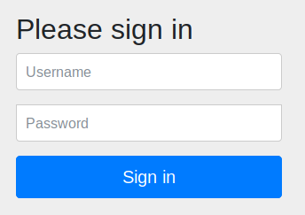
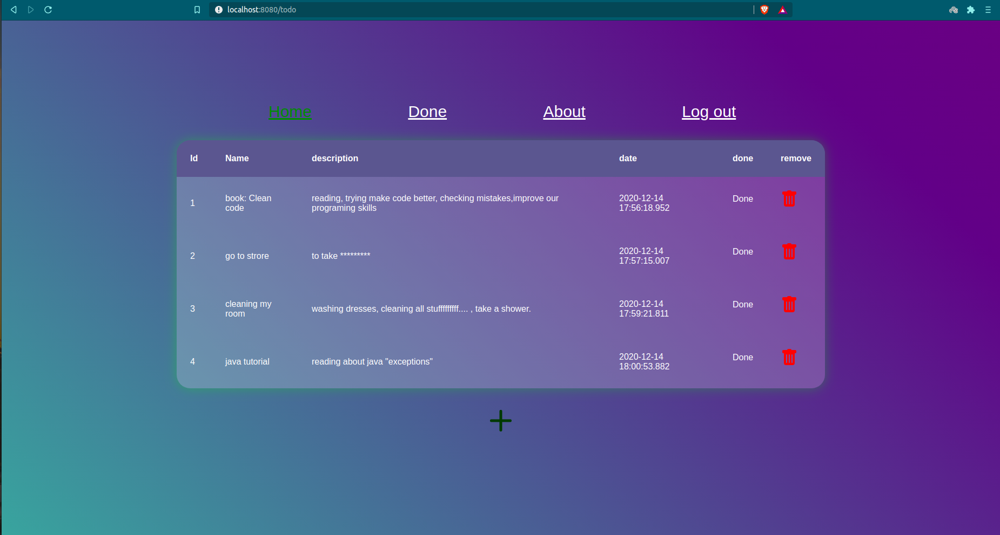
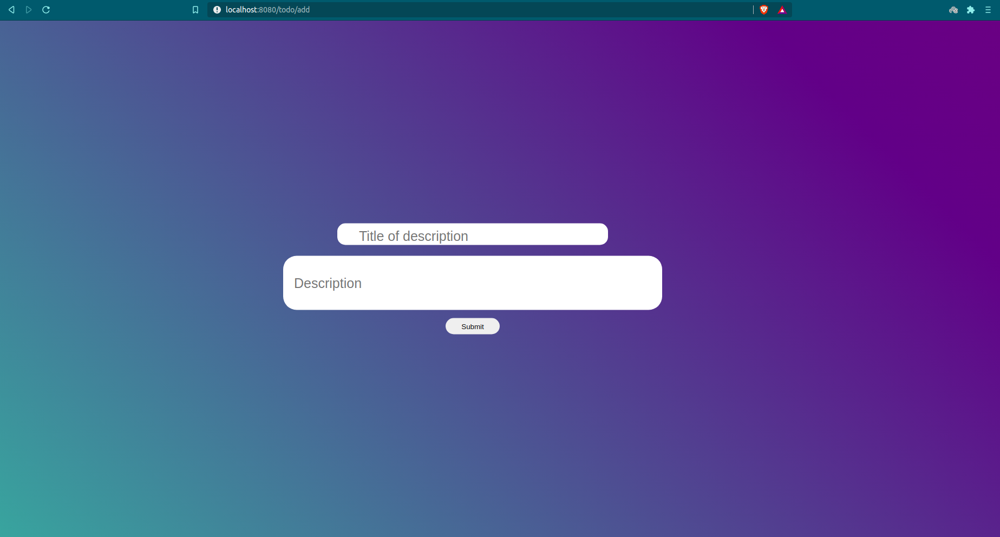
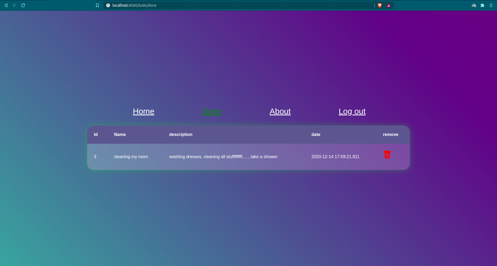
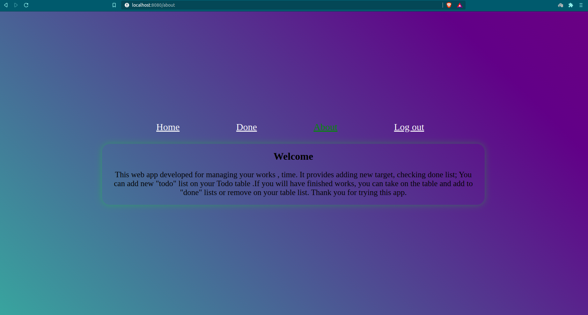

# Summary
 This project is written just to learn. My first Spring project. It contains:
 
  *  Spring boot
  *  Spring Security
  *  Spring JPA
  *  Spring Web
  *  Lombok (tools)
  *  Postgresql

#  1.Security

* User registration
* Authentication with DAO
* Authorization 

# 2.Spring JPA

* Hibernate
* Postgres

# 3.Tools

* Lombok
* etc

# About Todo Project

What is Todo List ?

# How to use it

# Login Page (default Spring security login page)

* enter your Username and password

# Todo table

# Add new target

# Finished works

# About Todo Web App

